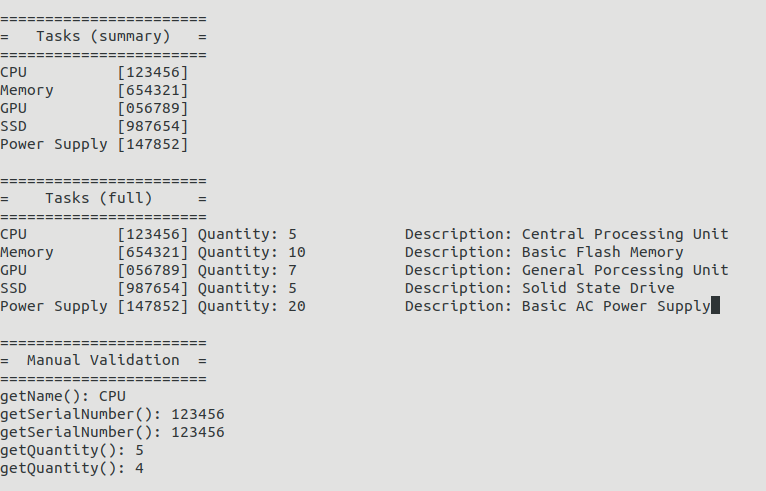
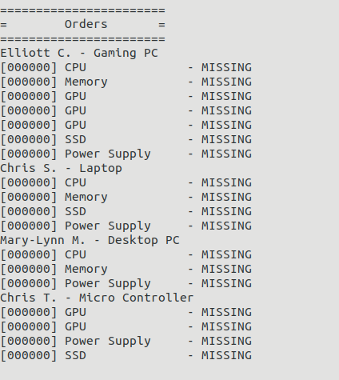
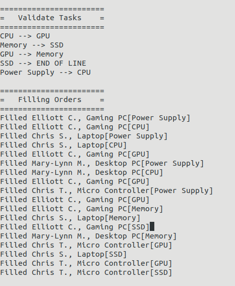
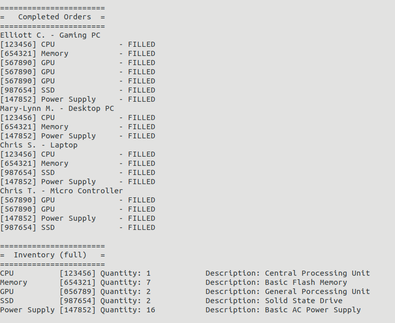

Simulated Assembly Line
=======================

C++ course project at Seneca College

The purpose of this term project is to put C++ Object Oriented skills to practice by developing a simulated Assembly Line.

The project simulates an assembly line that fills customer orders from inventory. Each customer order consists of a list
of items that need to be filled. The line consists of a set of stations. Each station holds an inventory of items for 
filling customer orders and a queue of orders to be filled. Each station fills the next order in the queue if that order
requests its item and that item is still in stock. A line manager moves the customer orders from station to station until
all orders have been processed. Any station that has used all of the items in stock cannot fill any more orders. Orders
become incomplete due to a lack of inventory at one or more stations. At the end of all processing, the line manager 
lists the completed orders and the orders that are incomplete.

The program mainly reads data from files. 
To run the executable on Linux 

`./run_linux Inventory1.dat Inventory2.dat CustomerOrders.dat AssemblyLine.dat`

#### Screenshot of the output

#### This project used advanced C++ features which includes:  
- C++ advanced data structure vector, deque
- C++ STL
- C++ algorithm from STL

#### Tools used
- Vim
- GDB Debugger

